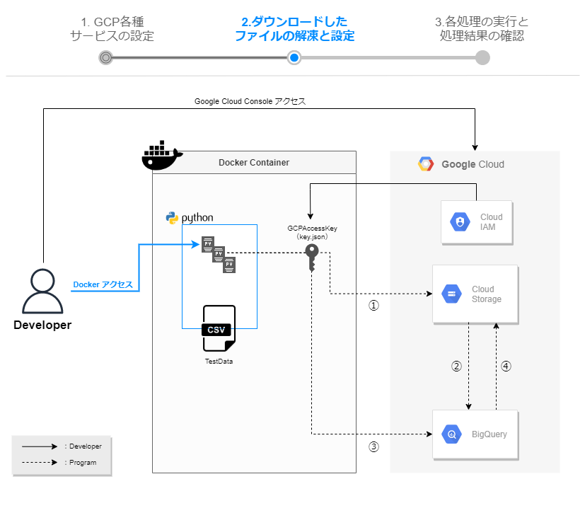
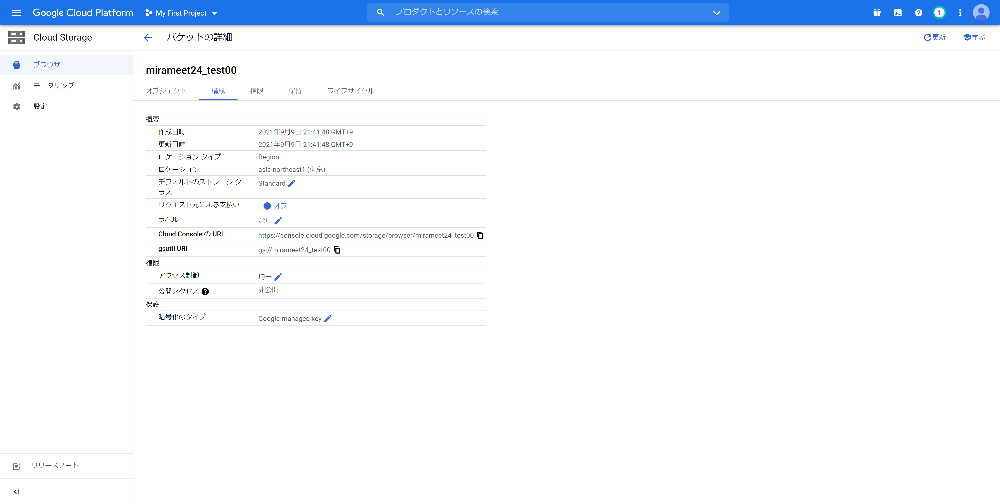
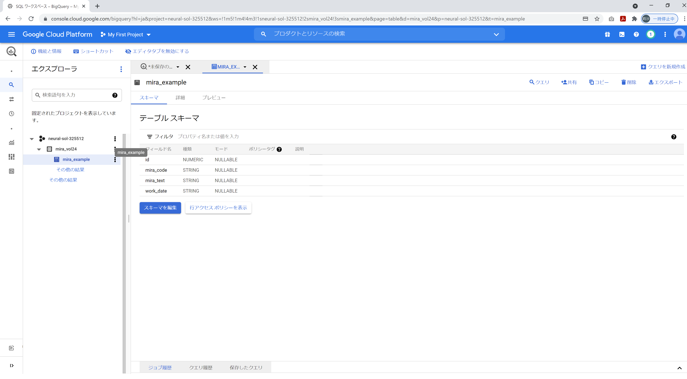

# ダウンロードしたファイルの解凍と設定  
この手順では、GithubからダウンロードしたZipファイルを任意のディレクトリで解凍し、設定していきます。
  

## OperationObject.pyの編集  
```
# ------------------------------------------------------
# 変数
# ------------------------------------------------------
GOOGLE_APPLICATION_CREDENTIALS='./credential/key.json'

# CSVコピー元
source_file_name = './csv/gcs-example.csv'

# CSVアップロード先
url_gs_example_csv="gs://mira-example/gcs-example.csv" # 手順1.1
# CSVエクスポート先
out_url_gs_example_csv="gs://mira-example/out-gcs-example.csv" # 手順1.1

# GCSバケット名
bucket_name = "mira-example" # 手順1.2

# 操作テーブル
project_id = "erudite-pride-323410" # 手順1.3
dataset_id = "mira_vol24" # 手順1.4
table_id = "mira_example" # 手順1.5
```

### gsutil URI  
Cloud Storageのバケットの情報から「gsutil URI」をコピーして置換  

（例）  
```
url_gs_example_csv="gs://mira-example/gcs-example.csv"
out_url_gs_example_csv="gs://mira-example/out-gcs-example.csv"
↓
url_gs_example_csv="gs://mirameet24_test00/gcs-example.csv"
out_url_gs_example_csv="gs://mirameet24_test00/out-gcs-example.csv"
```
### bucket_name  
グローバルに一意になるように作成したバケット名をコピーして置換  

（例）  
```
bucket_name = "mira-example"
↓
bucket_name = "mirameet24_test00"
```
### project_id  
GCPダッシュボードの左上から「プロジェクトID」をコピーして置換  

（例）  
```
project_id = "erudite-pride-323410"
↓
project_id = "neural-sol-325512"
```
### dataset_id  
「データセットID」を変更した場合、任意で設定した値に置換  

```
dataset_id = "mira_vol24"
```
### table_id  
テーブル作成時のクエリから変更した場合、任意で設定した値に置換  

```
table_id = "mira-example"
```

## ダウンロードしたjson形式の秘密鍵ファイルの配置  
・ファイル名を下記に変更  
```
key.json
```
・解凍したZipファイルのcredentialに配置  
```
～～～mirameetVol24-main\src\credential
```

